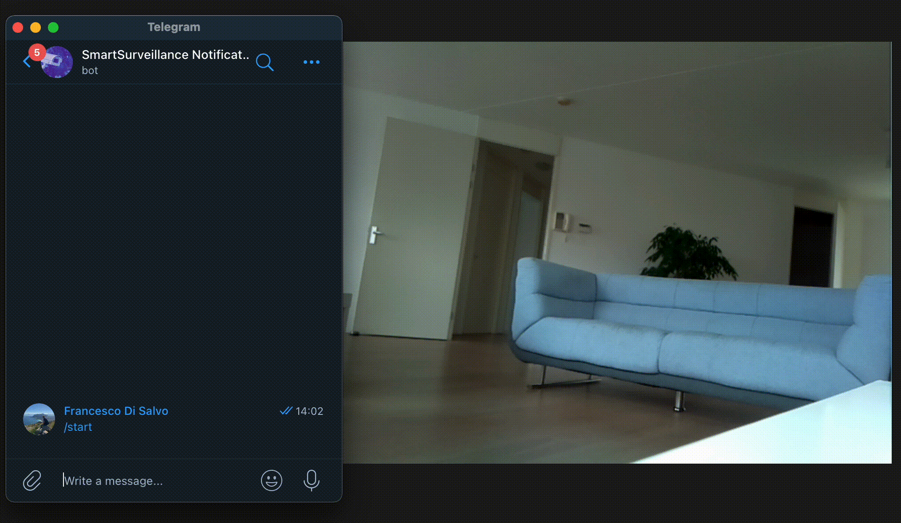

# Smart Surveillance on RaspberryPi

<p align="center">
  
</p>

### Contents
- [Description](#description)
- [Setup](#setup)
- [How to run it](#howtorun)
- [Demo](#demo)
- [Report](#report)
- [Contributors](#contributors)

---

<a name="description"/>

## Description
The vast majority of modern surveillance solutions involve a camera and motion sensors, and just a few of them **use artificial intelligence algorithms**. In this context, we decided to build an **indoor video surveillance system** capable of **recognizing the presence of a human intrusion**, rather than mere movement. In this way, a photo of the intruder can be taken instantly, eliminating the burden of reviewing the footage.

<a name="setup"/>

## Setup

1. Setup your RaspberryPi
  ```shell
sudo apt update && sudo apt upgrade
sudo apt install -y mosquitto mosquitto-clients
  ```
2. Install Python
```shell
sudo apt install -y python3.7 python3-venv python3.7-venv
```

3. Setup python environement
```shell
python3.7 -m venv py37
source py37/bin/activate
```

4. Download and install tensorflow
```shell
wget https://github.com/lhelontra/tensorflow-on-arm/releases/download/v2.3.0/tensorflow-2.3.0-cp37-none-linux_armv7l.whl
pip install -U pip
pip install tensorflow-2.3.0-cp37-none-linux_armv7l.whl
```

5. Install requirements
```shell
pip install -r assets/files/requirements.txt
```

6. Install microphone dependencies
```
sudo apt install -y libgpiod2
sudo apt install -y libatlas-base-dev
sudo apt install -y libportaudio2
```

7. Setup bot: Fill the following constants in src/bot/bot_settings.py
```
TOKEN = (str) bot's token
TOKEN_MSG = (str) token of the bot that will manage the messages
CHAT_IDS = (list) list containing all the chat ids of the people that will receive the notifications
```

<a name="howtorun"/>

### How to run it

You need to run four scripts, the camera publisher, the microphone publisher, the subscriber (the agent that will receive the notifications) and the bot.

```
python src/bot/botds.py
python pub_camera.py
python pub_microphone.py
python sub_bot.py

```


<a name="demo" />

### Demo

You can find some audio/video demos [here](assets/readme_utils)


<a name="Report" />


### Report


Do you wanna know more? Please have a look at our [presentation](https://github.com/francescodisalvo05/smart-surveillance-raspberrypi/blob/main/assets/files/Slides_SSSRP.pdf) or our technical [report](https://github.com/francescodisalvo05/smart-surveillance-raspberrypi/blob/main/assets/files/Smart_Surveillance_System_on_Raspberry_Pi.pdf)!


<a name="contributors" />

### Contributors

<a href="https://github.com/francescodisalvo05/smart-surveillance-raspberrypi/graphs/contributors">
  
</a>
